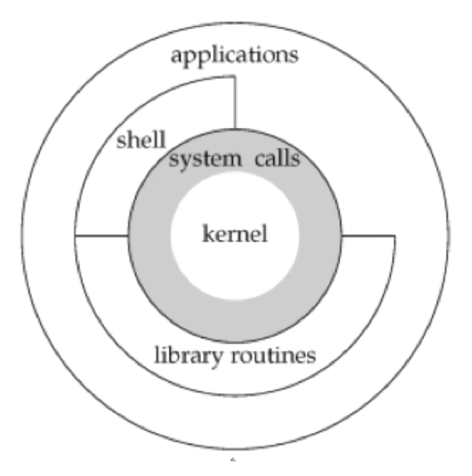
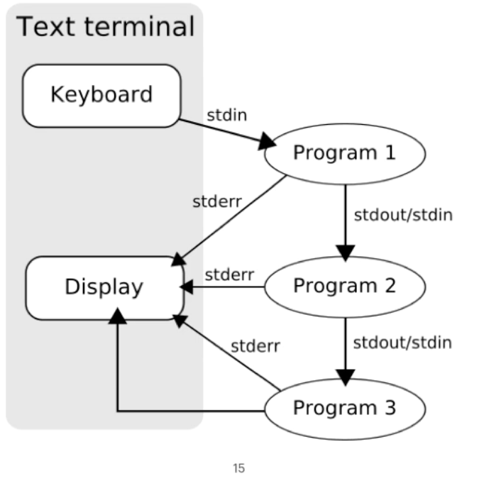

# Segment 3 UNIX Basics

Class: [[CS631]]
Subject: # Advanced Programming in the UNIX Environment
Date: 2025-09-08
Teacher: Jan Schaumann

## UNIX Basics: OS Design


The basic design of the Unix operating system can be
visualized somewhat like this:
1. At the core sits a **monolithic OS kernel**, which does all the heavy lifting: it initializes and controls the (physical or virtual) hardware, it manages memory, performs task scheduling, handles the filesystem, and interprocess communications etc.
2. Most Unix versions use such a monolithic kernel; notable differences here are Minix (a true microkernel), and Darwin, macOS, iOS etc., which use the XNU hybrid kernel, derived from the Mach microkernel developed at Carnegie Mellon.
3. The operating system provides a small number of so-called **system calls**, **hooks into kernel space** that allow the remainder of the OS to perform the required tasks.  System calls may then be wrapped by **library functions**, which are **executing in user space**. Applications generally call these library functions, but may also call system calls directly themselves.
4. The shell, carved out here in this graphic as somewhat separate, is actually nothing but a regular application, but since it provides the primary user interface we are calling it out separately.  We'll take a look at what a shell does and how it works in more detail in a moment.
## System calls and Library functions

- System calls are entry points into kernel code where their functions are implemented. They are documented in section 2 of the manual pages.
- Library calls are transfers to user code which performs the desired functions. They are documented in section 3 of the manual pages.

### How to use manual page

```
> man printf
```

- If we type simply 'man printf', then we will get the manual page from the first section, section 1, which covers general commands.  That is, there is a 'printf' utility.
- But frequently we do not want the command-line tool, but the library function.  So we have to explicitly specify the section as so:

```
> man 3 printf
```

- This now brings up the description of the library function 'printf', as desired.

- Similarly, if we type 'man write', then we get the description of the 'write' command.  So let's try to look for the function instead, following the previous example.

- As we type 'man 3 write', we find that there is no library function named 'write'.  That is because 'write' is a system call, and thus is described in section 2 of the manual pages.

```
> man 2 write
```

- **Note that the 'man' command will always pull up the first page it finds**.  That is, if there is no command by the given name, but there is a library function, then we do not need to type 'man 3'.  For example, simply typing 'man fprintf' will bring up the section 3 manual page because there is no 'fprintf' command and no 'fprintf' syscall.

## The C language

Even though the C programming language was developed as a systems programming language on and alongside the Unix systems, it is an OS agnostic language, and thus has a standard separate from what defines the Unix systems.

The important features that we got with ANSI C are:

- Function prototypes
	This allows us to use forward declarations, meaning we can separate the programming interface from the implementation.
- Generic pointers
	A `void *` pointer can be used to reference objects of unspecified type, so are generic in nature.  This provides a big amount of flexibility, but comes with some risks, as careless pointer manipulation and handling can lead to a number of software errors and vulnerabilities.
- Abstract data types (e.g. pid_t, size_t, etc)

Error handling:
- Meaningful return values
- `errno` variable
- lookup of constant error values via two convenient functions, `strerror(3)` and `perror(3)`

### Program design

UNIX Programs
- are simple
- follow the element of least surprise
- accept input from `stdin`
- generate output to `stdout`
- generate meaningful error messages to `stderr`
- have meaningful exit codes
- have a manual page

## UNIX Pipes



## Files and Directories

The UNIX filesystem is a tree structure, with all partitions mounted under the root (/). File names may consist of any character except / and NULL as pathnames are a sequence of zero or more filenames separated by /’s.

Directories are a type of file that provide a mapping between a filename and the internal data structure used to reference or look up the file in the filesystem, the inode.

That is, a filename is not a property of a file, but rather an entry in this directory, a mapping, a way to find the file object.

If we consider a directory as a simple lookup table that may give us the data associated with a file by the mapping of the file name, then we can already guess how a tool like the 'ls(1)' utility might work.

All processes have a current working directory from which all relative paths are specified. (Absolute paths begin with a slash, relative paths do not).

## User Identification

User IDs and group IDs are numeric values used to identify users on the system and grant permissions appropriate to them. Group IDs come in two types; primary and secondary.

## UNIX Time Values

Calendar time: measured in seconds since the UNIX epoch (January 1, 00:00:00, 1970, GMT). Stored in a variable of type `time_t`.

*Process time*: Central processor resources used by a process.
- Measured in clock ticks (`clock_t`). Three values: clock time, user CPU time, system CPU time

## Standard I/O

- Unix tools operate on stdin, stdout, and stderr; these are file streams by default connected to the terminal, and represented via the file descriptors 0, 1, and 2 respectively.  But this concept of file descriptors goes beyond just these numbers: all file I/O is done based on file descriptors - small, non-negative integers representing the file in question.
- **File descriptors**: Small, non-negative integers which identify a file to the kernel. The shell can redirect any file descriptor.
- Kernel provideds **unbuffered** I/O through open, read, write, lseek, close, these are all system calls.
- Kernel provides buffered I/O through fopen, fread, fwrite, getc, putc, these are all library functions

## Processes

-  Programs executing in memory are called processes.
- Programs are brought into memory via one of the exec(3) or execve(2) functions
- Each process is identified by a guaranteed unique non-negative integer called the processes ID (PID)
- New processes can only be created via the fork(2) system call
- Process control is performed mainly via the fork(2), exec(3), and waitpid(2) functions

## Signals

- Signals notify a process that a condition has occurred. Signals may be:
	- Allowed to cause the default action
	- Intentionally and explicitly ignored
	- Caught and control transferred to a user-defined function
